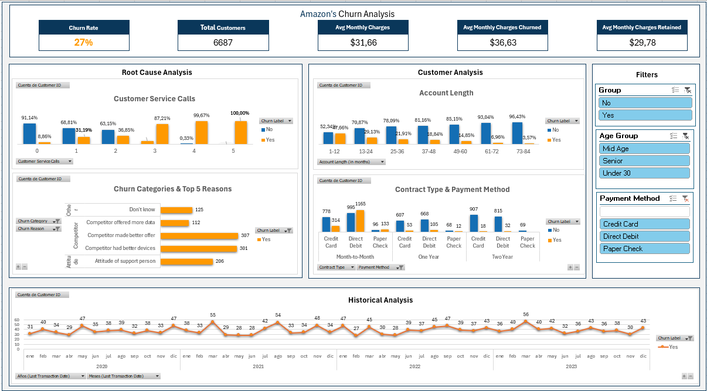

# Amazon's Churn Analysis in Excel


## Description

An exciting project where I have analyzed an Amazon's dataset from Kaggle using Microsoft Excel to clean, transform and analyse data to build an insightful interactive dashboard for an hypothetic client.

## Objective

The project's goal was to analyze the churn rate of customers subscribed to the Amazon's Prime Video streaming platform in order to identify patterns that helped us understand the reasons for customer attrition, enabling better strategic and operational decision-making.

Churn refers to the customer attrition rate (customers who have left compared to the total number of customers).

## Structure

```bash
Amazons_Churn_Analysis_in_Excel/
├── 0_Images/ #contains the images for this README
│   ├── churn.png
│   └── Dashboard.png
├── 1_Data_Raw/
│   └── amazon_churn_raw.xlsx #includes only the raw data, without any transformations or cleanage.
├── 2_Data_Transformed/
│   └── amazon_churn_transformed.xlsx #includes data cleaning and transformations.
├── 3_Data_Analysis/
│   ├── amazon_churn_descriptive_analysis.xlsx #includes descriptive univariate analysis of numerical columns and bivariate analysis of categorical and date columns.
│   ├── amazon_churn_descriptive_analysis_cat.xlsx #includes descriptive bivariate analysis of numerical columns.
│   └── amazon_churn_descriptive_analysis_num.xlsx #includes further descriptive bivariate analysis of categorical and date columns.
├── 4_Data_Dasboard/
│   └── amazon_churn_dashboard.xlsx #includes KPI definition, relevant columns selection and final dashboard (deliverable).
├── 5_Project_Notes/ #includes all my work notes and daily recaps of the different project stages.
│   ├── 1_PreAnalysis Notes.docx #includes descriptive univariate analysis of numerical columns and bivariate analysis of categorical and date columns.
│   ├── amazon_churn_descriptive_analysis_cat.xlsx #includes descriptive bivariate analysis of numerical columns.
│   └── amazon_churn_descriptive_analysis_num.xlsx #includes further descriptive bivariate analysis of categorical and date columns.
└── README.md
```

## Dataset Columns

**1.** **Customer ID (string)**: unique identifier for the subscriber.

**2.** **Churn Label (string)**: Yes/No label that identifies whether the subscriber has cancelled the subscription or not.

**3.** Churned (boolean): 1 if the subscriber cancelled subscription, 0 if the subscriber continues subscribed.

**4.** **Account Length (in months) (integer)**: duration of the current/last account of the subscriber.

**5.** **Customer Service Calls (integer)**: number of calls to the customer service.

**6.** **Avg Monthly GB Download (integer)**: average of monthly gigabytes downloaded.

**7.** **Unlimited Data Plan (Boolean)**: 1 stands for an unlimited data plan subscription and 0 for limited data plan subscription.

**8.** **Extra data charges (integer)**: extra payments for increasing data storage (in USD).

**9.** **State (string)**: US state abbreviation.

**10.** **Phone Number (string)**: subscriber phone number.

**11.** **Gender (string)**: gender of the subscriber.

**12.** **Age (integer)**: age of the subscriber.

**13.** **Under30 (string)**: Yes/No label that identifies whether the subscriber is under 30 years old or not.

**14.** **Senior (string)**: Yes/No label that identifies whether the subscriber is 65 years old or more or not.

**15.** **Group (string)**: Yes/No label that identifies whether the subscriber is included in a family subscription plan or not.

**16.** **Number of Customers in Group (integer)**: number of subscriber included in the family subscription plan.

**17.** **Device Protection & Online Backup (string)**: Yes/No label that identifies whether the subscription includes device protection and online backup or not.

**18.** **Contract Type (string)**: type of contract according to the subscription period (month-to-month, one year, two year, etc.).

**19.** **Payment Method (string)**: type of payment used by the subscriber for paying the last subscription period.

**20.** **Monthly Charge (integer)**: monthly payment of each subscriber in USD.

**21.** **Total Charges (integer)**: total money that has been charged for each subscriber since the beginning of the subscription period.

**22.** **Churn category (string)**: category of the reason for subscription cancellation.

**23.** **Churn Reason (string)**: reason for subscription cancellation.

**24.** **Contact Date (date)**: last contact date.

**25.** **Last Transaction Date (date)**: date of the last payment.

**26.** **Customer Tenure (in months) (integer)**: time since the first subscription.

**27.** **Customer Segment (string)**: some kind of customer level classification (high, medium or low).

**28.** **Average Monthly Expenses (float)**: average monthly expenses of each subscriber.

**29.** **Number of Complaints or Support (integer)**: number of times the subscriber has emitted a complaint or support request.

**30.** **Preferred Contact Method (string)**: preferred contact method of each subscriber.

**31.** **Applied Discount (string)**: indicates whether a discount has been applied (VERDADERO) or not (FALSO).

**32.** **Favorite TV show (string)**: favorite TV show of each subscriber.

**33.** **Internal Notes (string)**: internal notes about each subscriber.

## Which steps have I followed?

    1. Pre-Analysis: To familiarize ourselves with the fields, data types, and possible anomalies in our dataset. See notes (Pre-Analysis Notes.docx).
    2. Data Cleaning and Transformation: we will identify the fields relevant to our analysis and apply data cleaning and transformation techniques to streamline subsequent analysis (e.g., removing duplicates, handling missing values, etc.).
    3. Exploratory Data Analysis (EDA): A process where we will examine the data using pivot tables, descriptive statistics, distribution charts, etc., to start extracting insights that provide value.
    4. Dashboard: Creation of an interactive dashboard that will include the main KPIs, metrics, and key visualizations. The dashboard is the project deliverable, allowing users to monitor the data and detect patterns on their own.


